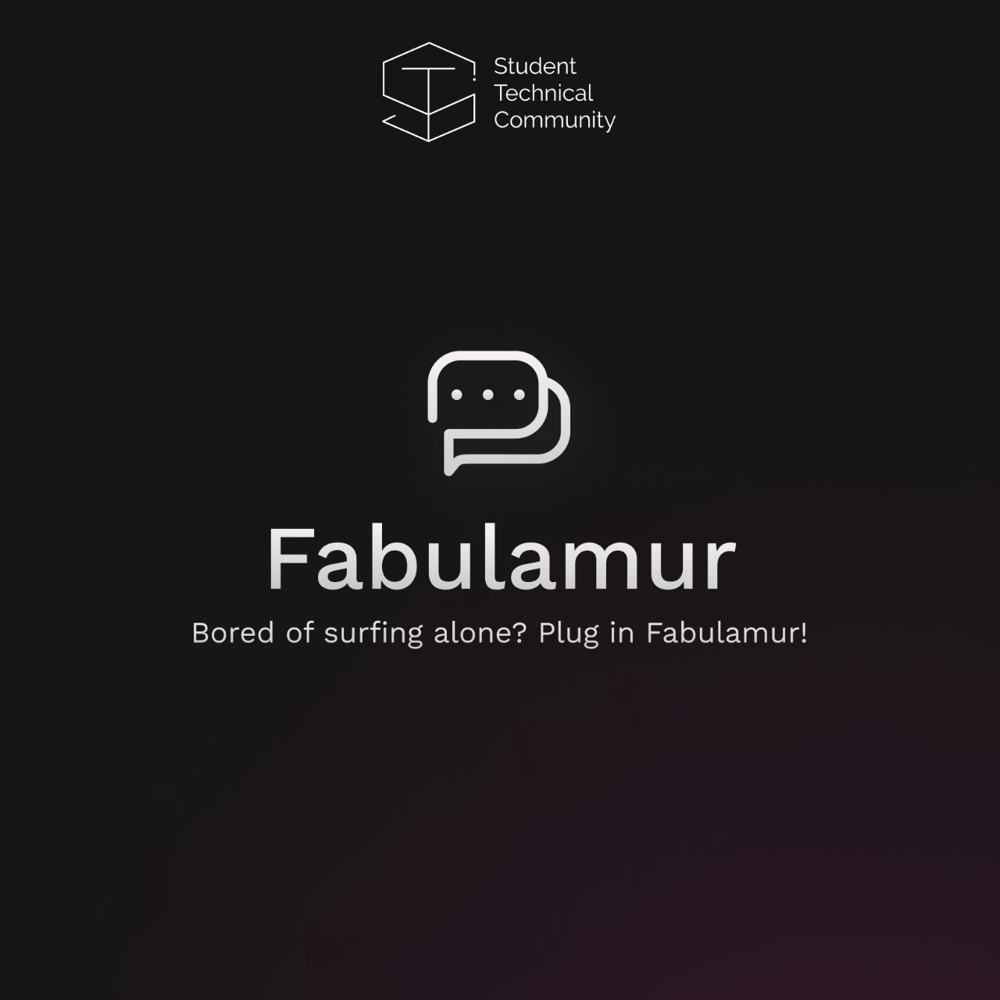
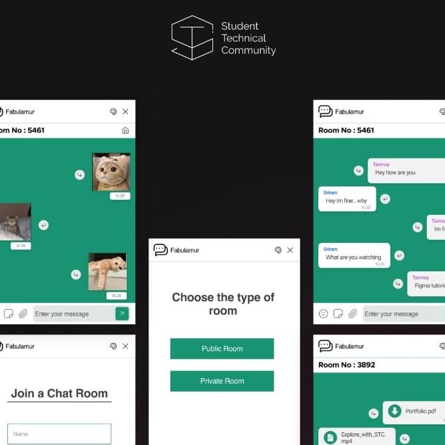
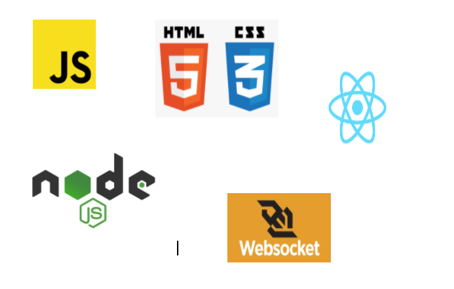

    

<h1>FABULAMUR</h1>

> <Subtitle>
> Fabulamur is a product that offers you the chance to interact with individuals who are enjoying the same content by letting you chat with them. It is an extension that allows connecting with users are on the same website.

---

## Images

 
 

## Built With

[]

## Features

- Real Time chatting with users on the same website.
- Ability to send photos and files.
- Enhanced Interaction through Stickers.
- Changing themes and colors according to your own preferences.
- Hosting public or private rooms.
- Interactive and attractive UI Design.

 

## Getting Started

Setting up the project

- Clone this project onto your computer.
- Run the command `npm install` to install node modules
- Then run the command `npm run build` to make a production version of it

Adding the extension to chrome

- Navigate to chrome://extensions on chrome browser.
- Switch on the Developer mode on the top right corner.
- Select **load unpacked**.
- Go to the folder where you have stored the project and select the folder named **build**
- Now you have your extensioin added onto your chrome
- When you want to use the extension you can click on the chrome chat extension in the top right of chrome to bring the chat popup.

## Contributors

- <a href="https://github.com/shah-tanmay">Tanmay Shah</a>
- <a href="https://github.com/Shriram-Sivanandam">Shriram Sivanandam</a>

## License

## Connect with Us

	Made with :heart: by <a href="https://stcvit.in/">STC-VIT</a>

